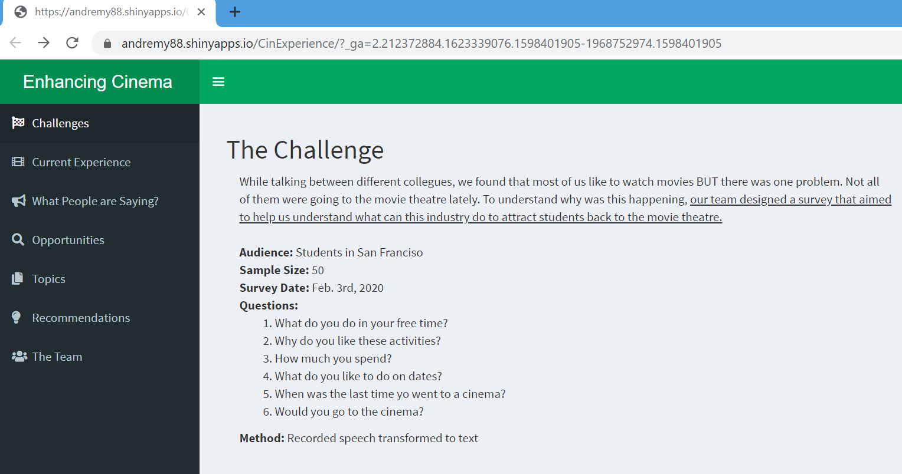
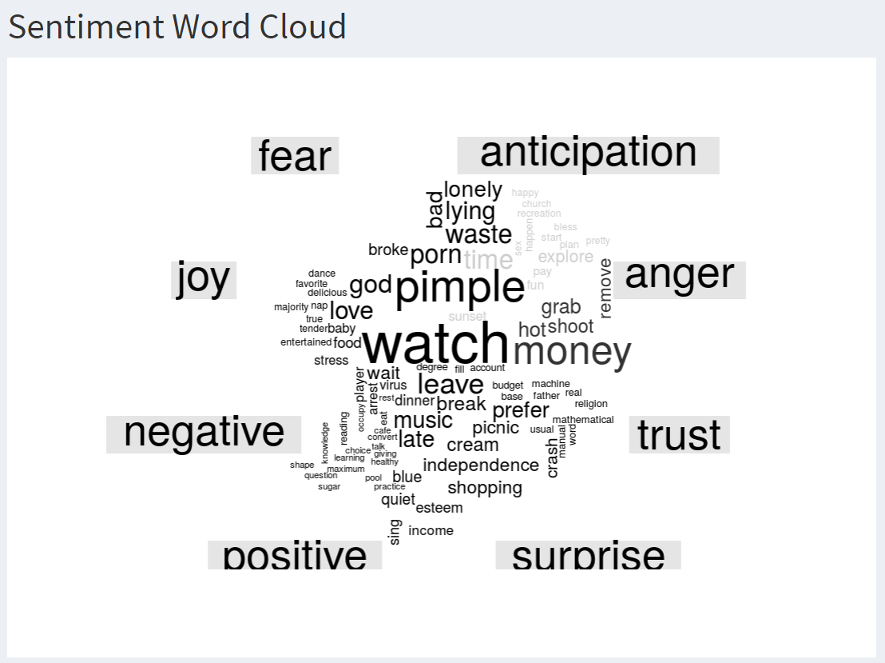
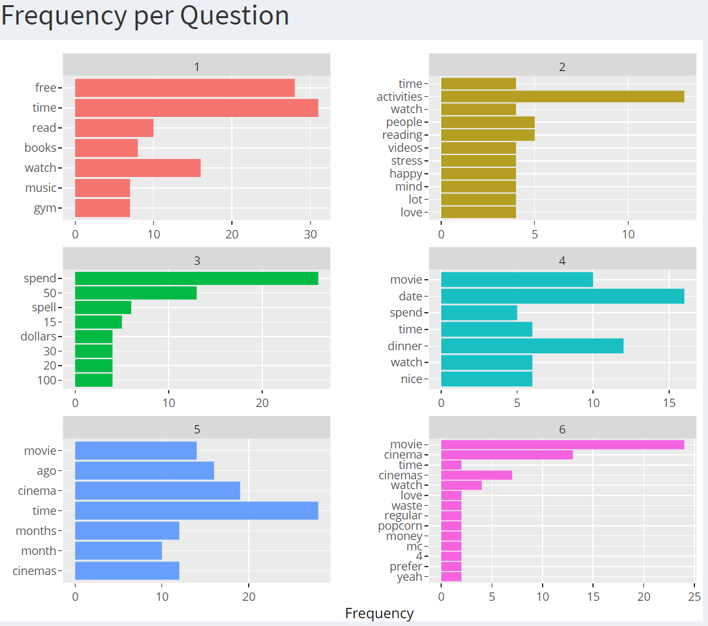
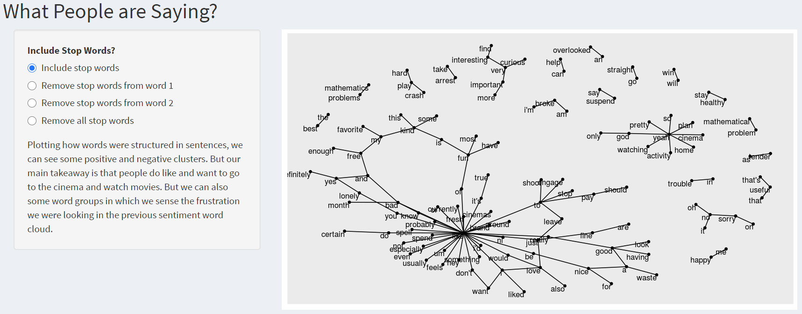
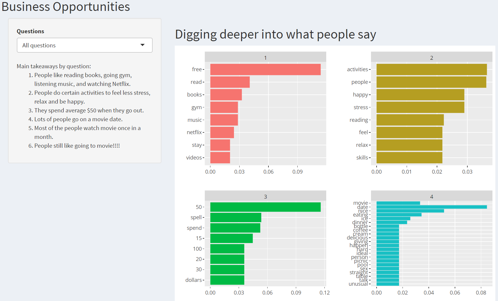
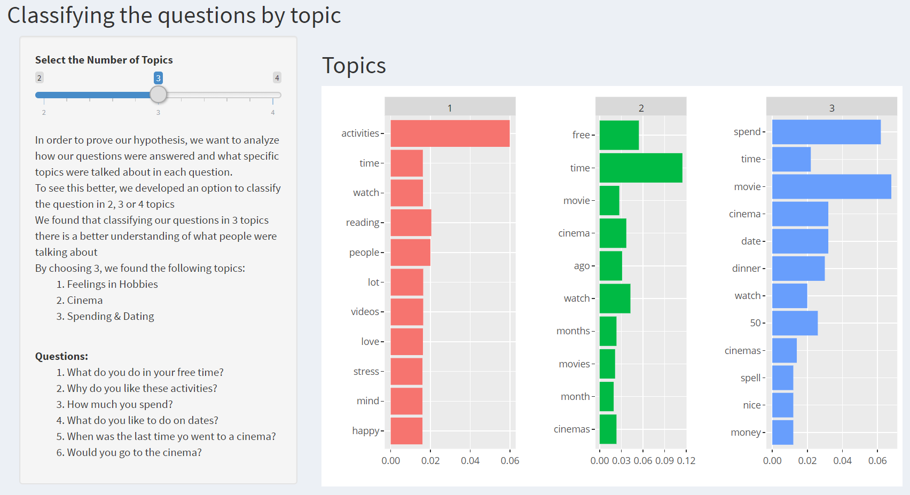

# CinExperience
Text mining project to understand what drives students of San Francisco to the movie theaters.
You can access the Web Dashboard [here](https://andremy88.shinyapps.io/CinExperience/). In case is not reachable, 
contact me ([Andre Remy](mailto:andreremy88@gmail.com)) and ask me to start the application.

##The Challenge
While talking between different colleagues, we found that most of us like to watch movies; but there was one problem. 
Not all of them were going to the movie theatre lately. To understand why was this happening, our team designed a survey
that aimed to help us understand what can this industry do to attract students back to the movie theatre. 

- **Audience:** Students in San Francisco
- **Sample Size:** 50
- **Survey Date:** Feb. 3rd, 2020
- **Questions:**
    1. What do you do in your free time?
    1. Why do you like these activities?
    1. How much you spend?
    1. What do you like to do on dates?
    1. When was the last time yo went to a cinema?
    1. Would you go to the cinema?
- **Method:** Recorded speech transformed to text

## Frameworks:
We started by creating a custom library with stop words specific to this project.

###Sentiment Analysis + Word Clouds
We used the NRC and Bing libraries to plot word clouds and understand what is the most common sentiment in our answers

###Frequency Charts
We also used the frequency chart to understand what are currently the most common words that describe the current 
cinema experience.

###Word Network
We used a word network (with and without stop words) so we can see the most common sentence formation and find what
people are saying.

###Frequency-Inverse document (tf-idf) 
To identify hidden opportunities, we created a tf-idf structure and analyzed what poeple might want from this cinem 
experience as a student.

###Unsupervised learning (LDA)
Finally, to improve our survey, we performed the LDA framework to identify common topics in our questions. This showed 
us what questions were answered in simliar ways and, as a result, identify what other question we can built to extend, 
confirm or deny these topics.

## The Team
- [Andre Remy](https://www.linkedin.com/in/andremy)
- [Hye Lim Kim (Becky)](https://www.linkedin.com/in/hyelimkim93/)
- [Mario Palazuelos](https://www.linkedin.com/in/mario-palazuelos-argaiz/)
- [Mats Lunde](https://www.linkedin.com/in/matsblunde/)
- Mohammed Yahya
- [Zhiyi Chen](https://www.linkedin.com/in/zhiyi-chen-4a987619a/)